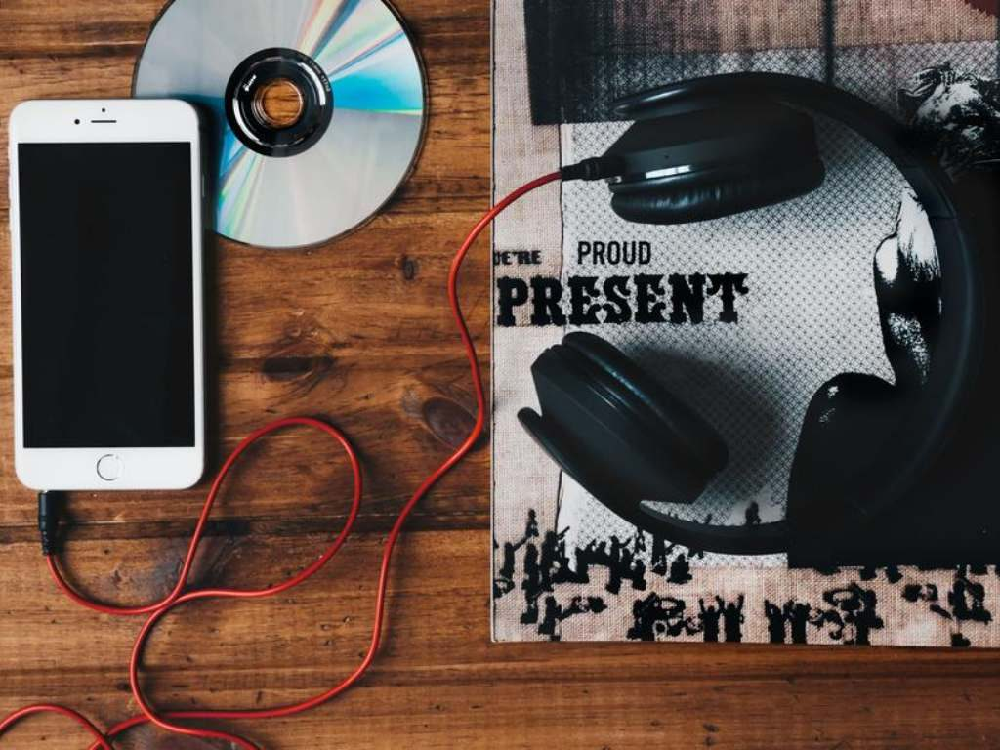

 # Proyecto-Visualizacion

## Indice

1. [Introduccion](#intr)
2. [Cantidad de artistas en el top por genero](#art)
3. [Ventas segun genero y album](#vent)
4. [Artistas mas repetidos en el top](#top)
5. [Conclusiones](#conc)

<a name="intr"/>

## Introduccion 🎵

En este proyecto mi principal obejtivo era analizar cual fue el genero musical que predomino mas desde el ano 1990 hasta 2021. Para esto decidi tomar los albums del top 3 dentro de ese intervalo de anos. Para esto decidi utilizar Power BI, lo que permitira captar la vista del publico objetivo sin problema alguno.

<a name="art"/>

## Cantidad de artistas en el top por genero 🎤

En primer lugar, observamos el porcentaje de artistas por genero musical que obtuvieron su album en el top 3 mundial. Con esta informacion podemos ver que genero es el que tuvo mas impacto a lo largo del tiempo.
Como podemos observar a continuacion, el genero que predomina es pop con casi la mitad del porcentaje total, seguido por pop y hip hop.

 
Gráfica

<a name="vent"/>

## Ventas segun genero y album 🛒

Continuando con el analisis, podemos observar que las ventas de los albums estan directamente relacionados con la cantidad de veces que se repiten estos artistas en el top.

 
Gráfica

Sin embargo, en este segundo grafico podemos ver que aunque el mas vendido es del genero pop, el segundo para nuestra sorpresa es de country. Mostrando una relacion no tan directa con lo visto anteriormente ya que estas reflejan las ventas individualmente.

 
Gráfica

<a name="top"/>

## Artistas mas repetidos en el top 🔝

Para culminar con el analisis, en el diagrama podemos ver los artistas que mas se repiten en los top. Viendose una clara diferencia entre los generos ya que muchos de los artistas que podemos ver son del genero pop.
Remarcando esa amplia diferencia que veniamo viendo.

 
Diagrama

 

<a name="conc"/>

## Conclusiones

Como vimos a lo largo de todo el analisis, podemos concluir firmemente que el genero que mas se repite a lo largo del tiempo es el pop, con una amplia diferencia con respecto al resto de los generos. Llevando a que las ventas de sus albums sean ampliamente superior al del resto de los generos.

